# Film Buzz 

## Introduction

Film Buzz is a movie blog platform built with Django, featuring full CRUD functionality that allows for creating, reading, updating, and deleting content. Users can explore insightful blogs, discover curated movie recommendations, and read thought-provoking reviews.

The aim of this project was to create a site that provides an engaging space for movie lovers to stay informed, share their passion for cinema, and connect with a like-minded community while offering dynamic content management capabilities.


Developed by **Ray Carter**

View live site here: [Film Buzz website](https://film-buzz-3729799f06ec.herokuapp.com/)

------

## Table of Contents

- [Overview](#overview)
  - [About](#about)
  - [Purpose](#purpose)
  - [Target Audience](#target-audience)
- [UX](#ux)
  - [Design Inspiration](#design-inspiration)
  - [Colour Scheme](#colour-scheme)
  - [Contrast Ratio: Primary Colours](#contrast-ratio-primary-colours)
  - [Contrast Ratio: Secondary Colours](#contrast-ratio-secondary-colours)
  - [Typography](#typography)
  - [Logo Design](#logo-design)
- [User Stories](#user-stories)
  - [Developer](#developer)
  - [Site Admin](#site-admin)
  - [New Site Users](#new-site-users)
  - [Registered Users](#registered-users)
- [Wireframes](#wireframes)
  - [Low-Fidelity Wireframes](#low-fidelity-wireframes)
  - [High-Fidelity Wireframes](#high-fidelity-wireframes)
- [Features](#features)
- [Database Design](#database-design)
  - [Entity Relationship Diagram](#entity-relationship-diagram)
  - [Models Overview](#models-overview)
  - [Standard Models](#standard-models) 
  - [Custom Models](#custom-models)
- [Agile Development Process](#agile-development-process)
  - [MoSCoW Prioritisation](#moscow-prioritisation)
  - [GitHub Projects](#github-projects)
  - [GitHub Issues](#github-issues)
- [Testing](#testing)
  - [Fictional Users](#fictional-users)
- [Deployment](#deployment)
  - [Connecting to GitHub](#connecting-to-github)
  - [Django Project Setup](#django-project-setup)
  - [Cloudinary API](#cloudinary-api)
  - [Heroku Deployment](#heroku-deployment)
  - [Clone Project](#clone-project)
  - [Fork Project](#fork-project)
- [Tools & Technologies Used](#tools--technologies-used)
  - [Libraries and Frameworks](#libraries-and-frameworks)
  - [Tools and Programmes](#tools-and-programmes)
- [Credits](#credits)
  - [Content](#content)
  - [Code](#code)
  - [Media](#media)
  - [Acknowledgements](#acknowledgements)
  
## Overview

### About

Film Buzz is a dynamic movie blog platform built with Django, designed to celebrate cinema and provide a space for movie lovers to explore, discuss, and engage with the world of film. 

The goal of this project is to create an accessible and engaging platform for casual viewers, film enthusiasts, and aspiring movie bloggers alike. Built with the powerful Django framework, Film Buzz combines functionality with user-friendly design to deliver an enjoyable and seamless experience for all.

### Purpose

Many movie enthusiasts struggle to find a platform where they can read insightful reviews, explore curated movie recommendations, and stay updated on the latest in cinema. While casual viewers seek engaging content to guide their next movie choice, aspiring reviewers and bloggers often lack a centralised space to share their thoughts and connect with like-minded individuals. This gap leaves movie lovers without an accessible, community-driven hub for exploring and discussing their passion for film.

Film Buzz aims to solve this problem by providing a simple and engaging platform for movie enthusiasts to:
- Discover insightful reviews on a variety of films.
- Explore curated movie recommendations tailored to different tastes and genres.
- Read thought-provoking blogs and articles about cinema, including behind-the-scenes content and trends.
- Engage with content designed to inspire a deeper appreciation for the art of film.
- Offer a space for aspiring movie bloggers and critics to share their perspectives and grow their audience.

By offering these features, Film Buzz becomes a hub for celebrating cinema, fostering connection, and guiding viewers in their cinematic journeys.

### Target Audience

Film Buzz is designed to cater to a wide range of movie lovers, each with unique needs and interests:
- **Movie Enthusiasts**:
    - People who are passionate about watching, reviewing, and discussing movies.
- **Casual Viewers**:
    - Individuals looking for movie recommendations and reviews to decide what to watch next.
- **Reviewers and Bloggers**:
    - Professionals or hobbyists who want to share detailed critiques and engage with their audience.
- **Social Users**:
    - Users who enjoy following others, discovering popular content, and engaging in discussions.
- **Students and Professionals in the Film Industry**:
    - Aspiring filmmakers, critics, and actors seeking inspiration and community insights.

## UX

### Design Inspiration

For detailed information on the research process and design inspiration for this project, please see the [research.md](https://github.com/raycarter23/film-buzz/blob/main/research.md) file.

### Colour Scheme

- YinMn Blue `#294E79` - used as the primary site colour, and secondary background colour for the footer.

- White `#FFFFFF` - used as site background colour for a clean and minimalistic design.

- Light Cyan `#D3F3FA` - used as an accent text colour on the YinMn Blue footer.

- Quinacridone Magenta `#79425B` - used as a secondary colour to add contrast and variety.

- Seal Brown `#603317` - used for the trash icon,  notification icon and warning buttons to ensure prominence and clarity.


To design a visually appealing and thematic colour palette for my website, I utilised a combination of [Color Hunt](https://colorhunt.co/) and [Coolors](https://coolors.co/). My goal was to craft a palette that resonates with movie enthusiasts, blending style and accessibility.

The centrepiece of this palette is **YInMn Blue**, chosen as the primary colour to define the brand identity of Film Buzz with its vibrant and modern appeal. Complementing this, I selected **White** as the background colour to ensure a clean, easy-to-read layout that enhances the overall user experience.

### Contrast Ratio: Primary Colours

I wanted to ensure that the chosen primary text colour (**YInMn Blue** - `#294E79`) and background colour (**White** - `#FFFFFF`) met the web accessibility standards outlined by [WCAG](https://www.wcag.com/). WCAG defines a minimum colour contrast ratio of **4.5:1** for normal text and **3:1** for large text.

I tested the contrast ratio using [Adobe’s](https://color.adobe.com/create/color-contrast-analyzer) colour contrast checker tool, which gave me a contrast ratio of **8.54:1**, and ensured that good readability for visually impaired site users. 

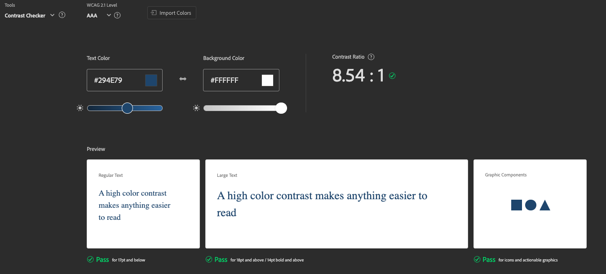

### Contrast Ratio: Secondary Colours

I also used [Venngage’s Accessible Color Palette Generator](https://venngage.com/tools/accessible-color-palette-generator) to create complementary colours that harmonise seamlessly with my primary colour while adhering to WCAG colour accessibility standards. To ensure optimal readability, I tested the contrast ratios of these colours using Adobe's Colour Contrast Checker tool. This process guided my design decisions and helped me pair colours effectively throughout my website.

For light cyan on a YInMn Blue background, I achieveed a contrast ratio of **7.3:1** 

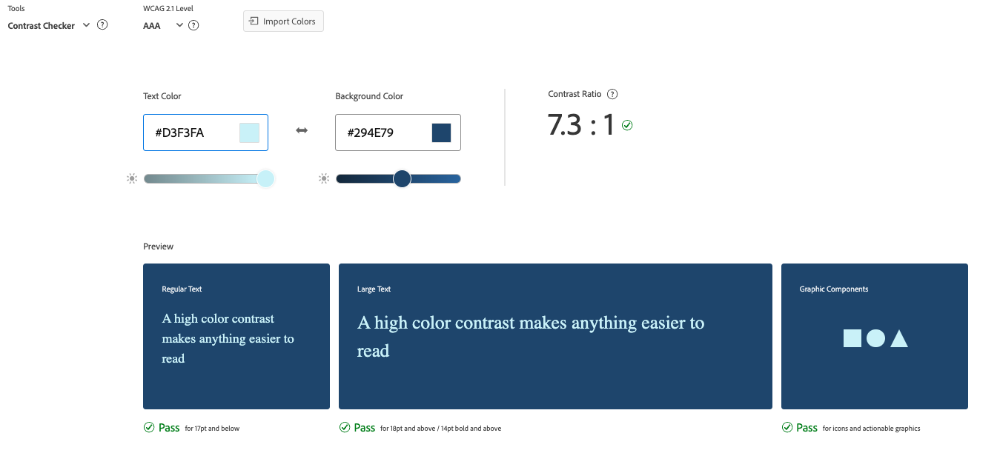


For quinacridone magenta on a white background, I achieved a contrast ratio of **7.65:1**

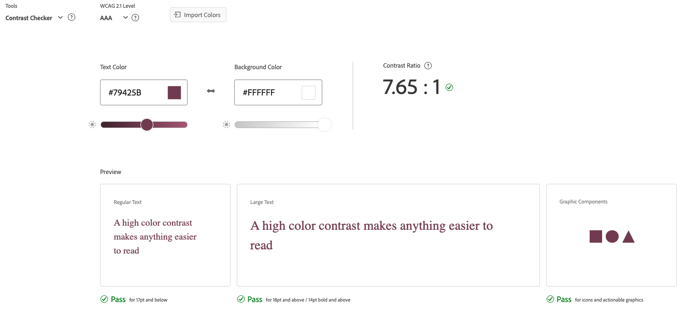


For seal brown on a white background, I achieved a contrast ratio of **10.59:1**

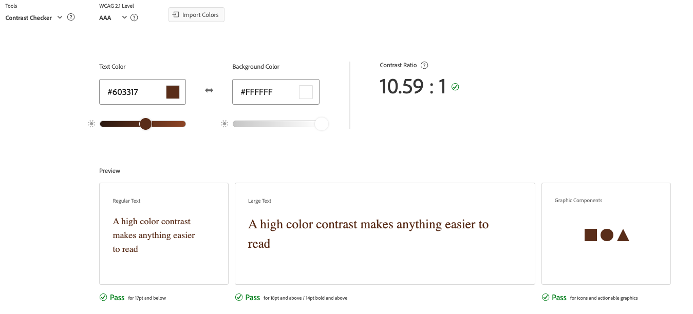

### Typography

- [Raleway](https://fonts.google.com/specimen/Raleway) - Used for headings and buttons.
- [Inter](https://fonts.google.com/specimen/Inter) - Used for site text and paragraphs.

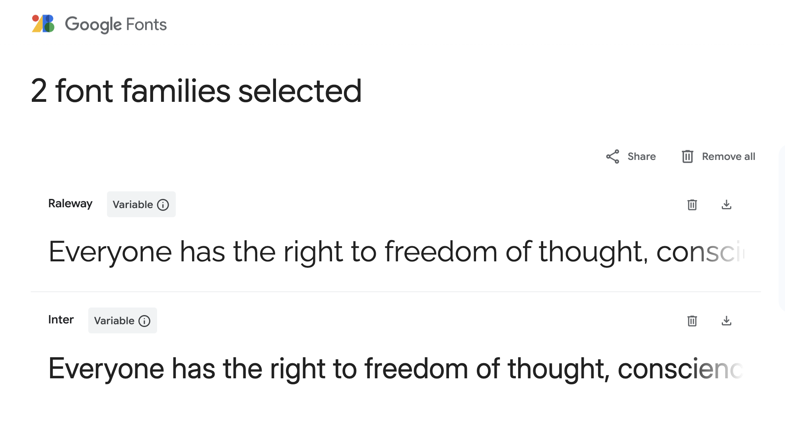

### Logo design

I used [Logo Design AI](https://logodesign.ai/) to generate the following logo design for my website. I also generated the same logo with a white background, which was used in the footer section of the website, and I removed the background using [Remove Bg](https://www.remove.bg/)


## User Stories

### Developer

- As a developer I can get an idea of the whole design system so that I can work on the UI/UX design. `Must Have`

- As a developer I can get an idea of which components to build so that I can work on the design system. `Must Have`

- As a developer I can build the pages based on the Figma designs so that I can check how the website looks in real time. `Must Have`

### Site Admin

- As an admin I can add, edit, or delete posts so that the database remains accurate. `Must Have`

- As a site admin, I can access a page exclusive to admins to view flagged user posts so that I can review posts that may need moderation or deletion. `Could Have`

- As a site admin, I can unflag a post if it does not require deletion so that I can remove it from the list of flagged posts. `Could Have`

- As an admin I can suspend user accounts who violate site guidelines so that I can prevent users from breaking the site rules. `Won’t Have`

- As an admin, I can view analytics on user activity and engagement so that I can better understand how the platform is performing. `Won’t Have`

### New Site users

- As a first time site visitor I can clearly see the website's purpose so that I can use it in the future. `Must Have`

- As a new site user I can create an account so that I can make my profile. `Must Have`

- As a site visitor/user I can easily navigate the site on any device so that I have a seamless experience whether on desktop or mobile. `Must Have`

- As a user/visitor I can see trending movies on the homepage so that I can discover what movies are popular right now. `Won’t Have`

### Registered users

- As a registered user I can login to my account so that I can access the site. `Must Have`

- As a registered user I can log out of my account so that I can delete session on my current device. `Must Have`

- As a registered user I can create posts so that I can share my thoughts about different movies. `Must Have`

- As an author I can edit my posts so that I can correct information in the future. `Must Have`

- As an author I can delete my posts so that I can remove content that I no longer want to be published. `Must Have`

- As a user I can view all the posts so that I can learn about different movies. `Must Have`

- As a commenter I can delete existing comments so that I can remove my opinions. `Must Have`

- As a user I can filter posts so that I can view posts of a specific movie genre. `Must Have`

- As a user I can search posts so that I can filter posts based on titles. `Must Have`

- As a registered user I can delete my account so that I can stop using the site when I no longer need it. `Should Have`

- As a registered user I can comment on other users' posts so that I can engage with them in a discussion. `Should Have`

- As a user I can follow other users so that I can keep up with their posts. `Should Have`

- As a registered user I can create my own watchlist so that I can track movies I am interested in watching. `Could Have`

- As a commenter I can edit my existing comments so that I can correct information. `Could Have`

- As a registered user I can update my profile information so that other users can identify me. `Could Have`

- As a registered user I can receive personalised movie recommendations based on my watchlist and reviews so that I can discover films tailored to my preferences. `Won’t Have`

- As a reviewer I can tag other users in comments so that I can engage directly with the community. `Won’t Have`

- As a registered user I can sync my watchlist with streaming platforms so that I know where to watch my saved movies. `Won’t Have`

## Wireframes

I used [Figma](https://www.figma.com/) to create low-fidelity and high-fidelity wireframes for my website. To follow best practices and aid with responsive design, wireframes were developed for **desktop**, **tablet** and **mobile** screen sizes.

---

### Low-Fidelity Wireframes

#### Home Page Wireframes
<details>
<summary>Click to view the Home Page Wireframes</summary>

**Mobile**  


**Tablet**  


**Desktop**  


</details>

#### About Page Wireframes
<details>
<summary>Click to view the About Page Wireframes</summary>

**Mobile**  


**Tablet**  


**Desktop**  


</details>

#### Blogs Page Wireframes
<details>
<summary>Click to view the Blogs Page Wireframes</summary>

**Mobile**  


**Tablet**  


**Desktop**  


</details>

---

### High-Fidelity Wireframes

#### Home Page Wireframes
<details>
<summary>Click to view the Home Page Wireframes</summary>


</details>

#### About Page Wireframes
<details>
<summary>Click to view the About Page Wireframes</summary>


</details>

#### Blogs Page Wireframes
<details>
<summary>Click to view the Blogs Page Wireframes</summary>


</details>

#### Login Page Wireframes
<details>
<summary>Click to view the Login Page Wireframes</summary>


</details>

#### Signup Page Wireframes
<details>
<summary>Click to view the Signup Page Wireframes</summary>


</details>

#### Not Found Page Wireframes
<details>
<summary>Click to view the Not Found Page Wireframes</summary>


</details>

## Features

### Home Page
This is the page a user views for the first time when he/she enters the site. It has a navbar on top for the navigation menu and search bar. I have a hero section with a Call-To-Action button. It features the top 3 trending posts. Trending posts are selected based on the highest number of comments. Then, users can see the latest posts, categories, and recent comments.

<details>
<summary>Click to view Homepage features</summary>

 
 


</details>

### About Page
This page gives a brief introduction to the website. It consists of different sections like Vision, Mission, and Frequently Asked Questions.

<details>
<summary>Click to view About Page features</summary>

 


</details>

### Blogs Page
The blogs page displays all the existing posts on the website. At the top, users can see the featured post, which is the most recent post on the blog. I have 10 different movie categories listed in separate cards. My blog module supports pagination, which is defined dynamically based on the post count.

<details>
<summary>Click to view Blogs Page features</summary>

 
 


</details>

### Nav Menu
The nav menu contains everything the user will need to navigate the site. The site logo, along with pages and a search bar, always appears on the site menu. It also provides buttons for Sign Up and Login. If the user is already authenticated, these buttons are replaced with Profile and Logout.

<details>
<summary>Click to view Nav Menu features</summary>

 


</details>

### Search Bar
I have a search bar on the navigation menu that allows users to search for posts across the blog. Users can type their query into the textbox, and based on the parameter, I match it with titles of all the blog posts and serve the search results.

<details>
<summary>Click to view Search Bar features</summary>

 


</details>

### Footer
The footer appears across the website and includes information about Film Buzz and links to my Twitter, LinkedIn, and GitHub profiles. This lets the user learn more about me as the developer and connect on these platforms if they wish.

<details>
<summary>Click to view Footer features</summary>

 

</details>

### Sign Up
For account creation, the user needs to fill out the sign-up form with their username, email, and password (entered twice). Note that all these fields are validated in the background. The username/email must be unique, and the passwords must match and be strong.

<details>
<summary>Click to view Sign Up features</summary>

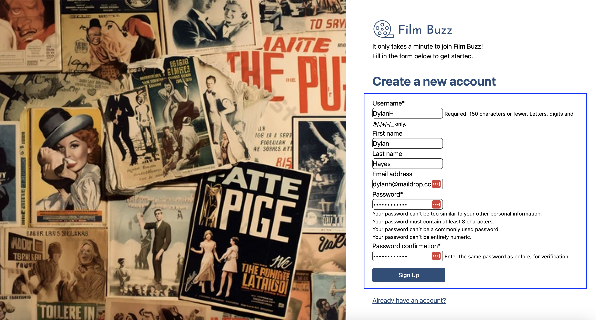 

</details>

### Login
After account creation, a user can log in to the website. He/she will need to provide their registered username and password. After clicking the login button, I perform an authentication check in the backend. If the credentials match, the user is redirected to the home page. Otherwise, an error message is displayed based on the issue.

<details>
<summary>Click to view Login features</summary>

 


</details>

### Post Details
Users can view the details of a post by clicking on the post cards. On the post details page, they can see the featured image, description, creation date and time, and the category of the post.

<details>
<summary>Click to view Post Details features</summary>

 


</details>

### Edit Post
Authenticated users can edit their posts. On the post details page, there is an edit button that redirects to the edit post form. Users can update the title, content, category, and featured image of the post. After making changes, they can save the updates, which will reflect immediately on the post details page.

<details>
<summary>Click to view Edit Post features</summary>

 
 
 


</details>

### Delete Post
Authenticated users can delete their posts. On the post details page, there is a delete button. Upon clicking, a confirmation page appears to prevent accidental deletions. Once confirmed, the post is permanently removed from the website, and the user is redirected to the blogs page.

<details>
<summary>Click to view Delete Post features</summary>

 
 


</details>

### Comments
Logged-in users can comment on any post. They can scroll down to the bottom of the post details page and use the comment form to add their comment. They can also edit and delete their comments in case of a change of mind.

<details>
<summary>Click to view Comments features</summary>

 


</details>

### Edit Comment
Logged-in users can edit their comments. On the post details page, each comment has an edit button next to it. Clicking the edit button opens a form where users can modify the content of their comment. After making changes, they can save the updates, which will reflect immediately on the post details page.

<details>
<summary>Click to view Edit Comment features</summary>

 
 


</details>

### Delete Comment
Logged-in users can delete their comments. On the post details page, each comment has a delete button next to it. Once clicked, the comment is permanently removed from the post.

<details>
<summary>Click to view Delete Comment features</summary>

 


</details>

### User Profile
Every registered user has their profile. The profile page displays the user's information based on the sign-up form values. It also displays some additional info, including bio, profile picture, joining date, and location. The joining date is dynamically stored in the database upon account creation. Initially, the bio, profile picture, and location are empty. Users can go to the edit profile section to update them. Note that the username and email are permanent and cannot be changed (except in special cases agreed upon by the superuser).

<details>
<summary>Click to view User Profile features</summary>

 
 


</details>

### Filter Posts by Author
On a user's profile, only posts created by that user are shown. My posts section also supports pagination, just like the blogs page.

<details>
<summary>Click to view Filtered Posts by Author features</summary>


</details>

### Pagination
On my blog and profile pages, I have implemented pagination for better user experience. It shows 6 posts per page. There are next/prev buttons along with oldest/latest buttons. The current page number and the total page number are shown in the middle.

<details>
<summary>Click to view Pagination features</summary>

 
 


</details>

### Categories
There are 10 different film categories on my website. They are predefined by the admin, and users can only select from the available categories. On the home and blogs pages, I list the categories in a card format. By clicking on any of them, users can view posts specific to that category.

<details>
<summary>Click to view Categories features</summary>

 
 


</details>

### Recent Comments
The most recent 3 comments are displayed on the homepage based on comment creation time. Each of these comments is clickable and links to the post where the comment was made.

<details>
<summary>Click to view Recent Comments features</summary>

 


</details>

### 404 - Not Found
If a user tries to access any invalid URL not listed in my project, they are redirected to the 404 page. The Back to Home button takes the user back to the homepage.

<details>
<summary>Click to view Not Found Page features</summary>


</details>

### Admin Panel
Superusers and staff can log in to the admin dashboard and have control over all the models. This page contains a list of all the posts, categories, movies, watchlist entries, and comments. Admins can edit or delete any of these entries as needed.

<details>
<summary>Click to view Admin Panel features</summary>

 
 
 
 
 
 


</details>

## Database Design

I created an Entity Relationship Diagram using [Miro](https://miro.com/) to visually represent the relationships between the data models in Film Buzz, such as users, posts, comments, categories, and watchlists. This diagram highlights key relationships, such as the one-to-many connection between users and posts, and the many-to-many self-referential relationship for followers. 

To improve clarity, I colour-coded the database tables: standard models, such as users, posts and comments, are shown in grey; while custom models, such as watchlists, and categories are displayed in blue. This approach ensures the database structure aligns with the application’s requirements and supports features like filtering by categories, and tracking personalised watchlists.

### Entity Relationship Diagram

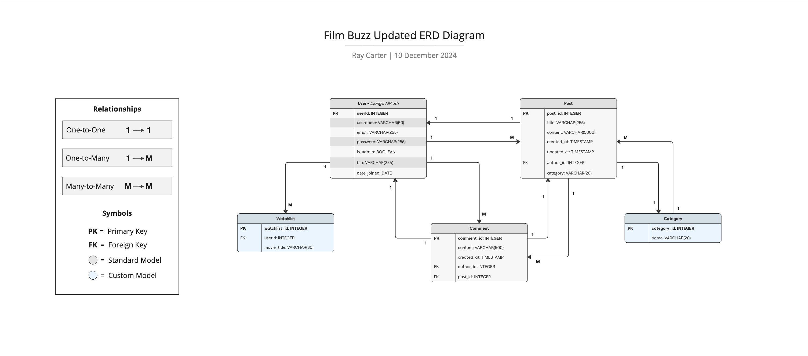

### Models Overview

The Film Buzz platform uses three standard models (**User**, **Post**, and **Commen**t) and two custom models (**Category**, and **Watchlist**) to manage its data structure. The standard models provide the foundation for user authentication, content creation, and engagement, while the custom models introduce features such as post-categorisation and personalised watchlists. These models are interconnected through carefully designed foreign key relationships, ensuring data integrity, consistency, and efficient interaction across the platform's features.

### Standard Models 

**User Model**

The User model represents registered users on the Film Buzz platform. It is the central model for user authentication, profile management, and role determination. This model allows for features such as user sign-up, login, and account customisation.

- User - Django AllAuth Model

| Key           | Field       | Type         | Purpose                                  |
|---------------|-------------|--------------|------------------------------------------|
| **Primary Key** | `userId`    | INTEGER (PK) | Unique identifier for each user          |
|               | `username`   | VARCHAR(50)  | Display name chosen by the user          |
|               | `email`      | VARCHAR(255) | User's email for authentication and contact |
|               | `password`   | VARCHAR(255) | Hashed password for secure login         |
|               | `is_admin`   | BOOLEAN      | Indicates whether the user has admin privileges |
|               | `bio`        | VARCHAR(255) | Optional biography or personal description |
|               | `date_joined`| DATE         | Date when the user registered on the platform |

**Relationships**

- **One-to-Many with the Post model**:
  - A user can create multiple posts.
  - Linked via the `author` field in the Post model, which is a foreign key to the User model.
- **One-to-Many with the Comment model**:
  - A user can leave multiple comments on posts.
  - Linked via the `author` field in the Comment model, which is a foreign key to the User model.
- **Many-to-Many with itself (Follow model)**:
  - Represents user-to-user connections, such as followers and followees.
  - Managed through a self-referential relationship in the Follow model.

---

**Post Model**

The Post model represents a blog post or movie review created by a user on the Film Buzz platform. Each post serves as a piece of content that users can view, interact with, and categorise. Posts are associated with an author (user), timestamps, and categories to provide structure and allow for filtering and moderation.

- Post Model

| Key           | Field       | Type         | Purpose                                  |
|---------------|-------------|--------------|------------------------------------------|
| **Primary Key** | `post_id`   | INTEGER (PK) | Unique identifier for each post          |
|               | `title`      | VARCHAR(255) | Title of the post or review              |
|               | `content`    | VARCHAR(5000)| Main body of the post or review          |
|               | `created_at` | TIMESTAMP    | Records the date and time the post was created |
|               | `updated_at` | TIMESTAMP    | Records the date and time the post was last modified |
| **Foreign Key**| `author_id`  | INTEGER (FK) | Links the post to the user who created it |
|               | `category`   | VARCHAR(20)  | Categorises the post into a specific genre or type |

**Relationships**

- **One-to-Many with User**:
  - A single user (author) can create multiple posts.
  - The `author_id` field serves as a foreign key linking the Post model to the User model.
- **One-to-Many with Comment**:
  - A single post can have multiple comments.
  - Linked via the `post_id` field in the Comment model.
- **Many-to-One with Category**:
  - Each post belongs to one category, which helps users filter posts by genre.

---

**Comment Model**

The Comment model represents user-generated comments on posts in Film Buzz. It allows users to share their thoughts or feedback on a specific post, fostering engagement and community interaction on the platform. Each comment is tied to a specific user (the author of the comment) and a specific post.

- Comment Model

| Key           | Field       | Type         | Purpose                                  |
|---------------|-------------|--------------|------------------------------------------|
| **Primary Key** | `comment_id`| INTEGER (PK) | Unique identifier for each comment       |
|               | `content`    | VARCHAR(500) | Stores the text of the comment           |
|               | `created_at` | TIMESTAMP    | Records when the comment was created     |
| **Foreign Key**| `author_id`  | INTEGER (FK) | Links the comment to the user who authored it |
|               | `post_id`    | INTEGER (FK) | Links the comment to the post it belongs to |

**Relationships**

- **One-to-Many with User**:
  - A single user (User) can author multiple comments (Comment).
  - The `author_id` field links the Comment model to the User model.
- **One-to-Many with Post**:
  - A single post (Post) can have multiple comments (Comment).
  - The `post_id` field links the Comment model to the Post model.

### Custom Models

**Category Model**

The Category model represents the predefined genres or classifications for blog posts or reviews on Film Buzz. Each category groups related posts to improve organisation, filtering, and discoverability.

- Category Model

| Key           | Field       | Type         | Purpose                                  |
|---------------|-------------|--------------|------------------------------------------|
| **Primary Key** | `category_id`| INTEGER (PK) | Unique identifier for each category      |
|               | `name`       | VARCHAR(20)  | Stores the name of the category (e.g. "Comedy") |

**Relationships**

- **One-to-Many with Post**:
  - A single category can have many posts assigned to it.
  - The `category_id` field is referenced as a foreign key in the Post model.

---

**Watchlist Model**

The Watchlist model represents a personalised list of movies that a user wants to keep track of on Film Buzz. It allows users to save the titles of movies they are interested in watching, creating an organised system for tracking and revisiting their favourite picks or upcoming films.

- Watchlist Model

| Key           | Field       | Type         | Purpose                                  |
|---------------|-------------|--------------|------------------------------------------|
| **Primary Key** | `watchlist_id`| INTEGER (PK) | Unique identifier for each watchlist entry |
| **Foreign Key**| `user_id`    | INTEGER (FK) | Links the watchlist entry to the owning user |
|               | `movie_title`| VARCHAR(30)  | Stores the title of the movie in the watchlist |

**Relationships**

- **One-to-Many with User**:
  - A single user can have multiple movies in their watchlist.
  - The `user_id` field acts as a foreign key linking the Watchlist model to the User model.

---

## Agile Development Process

### MoSCoW Prioritisation

For the Film Buzz project, I adopted a structured approach to managing features by breaking down larger Epics into smaller, actionable user stories. 

This method allowed me to clearly define and prioritise each story using the [MoSCoW framework](https://www.agilebusiness.org/dsdm-project-framework/moscow-prioririsation.html), which was implemented in the [Issues](https://github.com/raycarter23/film-buzz/issues) tab with appropriate labels.

- **Must Have**: Critical features that are essential for delivery - `comprising up to 60% of the total stories`
- **Should Have**: Important features that add considerable value but are not critical for the core functionality - `accounting for about 20% of the stories`
- **Could Have**: Optional features with a minor impact if excluded - `representing another 20%`
- **Won't Have**: Low-priority features that are not included in the current iteration but may be revisited in the future 


### GitHub Projects 

I used [GitHub Projects](https://github.com/users/raycarter23/projects/3) as an Agile tool to streamline the development process for this project.

The **Kanban Board** provided by GitHub Projects enabled me to:
- Organise tasks according to the development cycle phases: Backlog, To Do, In Progress, and Done
- Map out the workflow for user stories and their implementation
- Visualise the progression of user stories at every stage
- Track progress by moving tasks across columns as they were completed

Here is an overview of my GitHub Projects setup at the beginning of the development process:

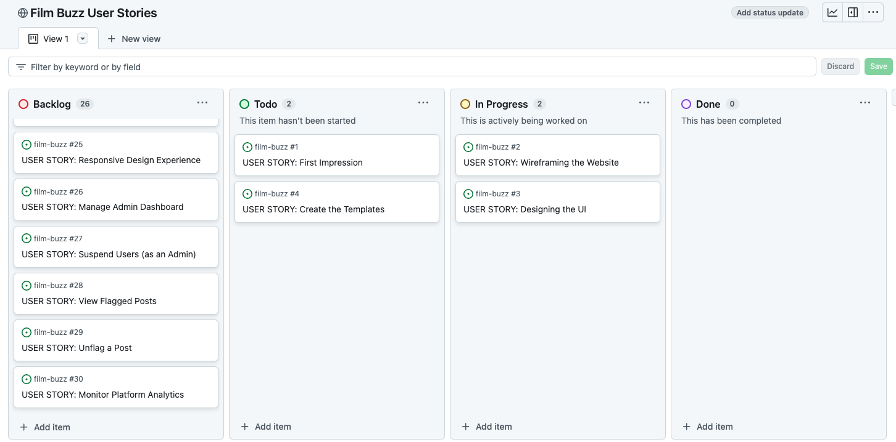

### GitHub Issues

I used GitHub Issues to create and manage my User Stories.

My User Stories were created using the following template:

- As a **role** I can **capability** so that **received benefit** 

For each user story, I defined its acceptance criteria, and any tasks relating to its completion.

Once I mapped out my user stories, I added them to my GitHub Projects board with their MoSCoW prioritisation labels

Here is what my GitHub issues looked like at the **start** of the initial development process:

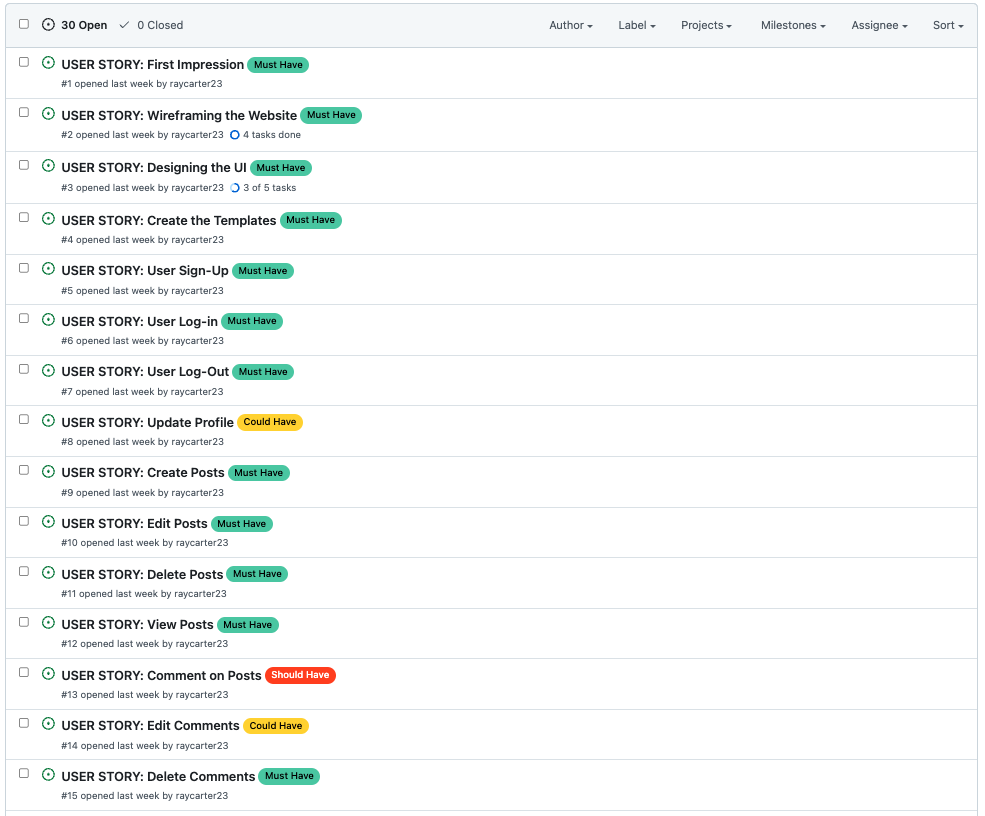

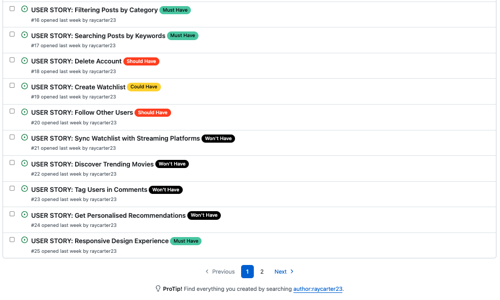

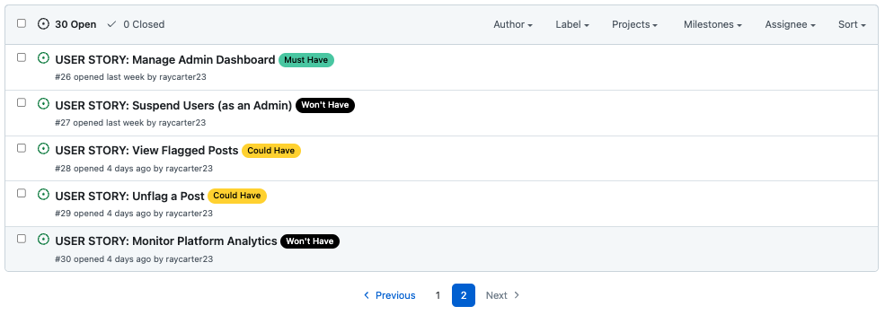

Here is what my GitHub issues looked like at the **end** of the development process:

- [Open Issues](https://github.com/raycarter23/film-buzz/issues?q=is%3Aopen+is%3Aissue)


- [Closed Issues](https://github.com/raycarter23/film-buzz/issues?q=is%3Aissue+is%3Aclosed)


## Testing 

For detailed information on testing, please see the [TESTING.md](https://github.com/raycarter23/film-buzz/blob/main/TESTING.md) file.

### Fictional Users

For my website, I created a series of fictional characters to test the CRUD functionality of my website. The copy for the fictional users was generated through [ChatGPT](https://openai.com/index/chatgpt/), and the images were sourced through [Pexels](https://www.pexels.com/). All images are copyright-free and used for testing purposes only. These fictional users could also be used to test out future features which are yet to be implemented, such as the follow feature for example.

Below is a list of 17 fictional users with unique first and second names that have been created to populate the Film Buzz website, and to test its CRUD functionalities. Each name reflects the user’s personality or film interests:

| Name               | Username  | Description                                                  | Image Link                                                                                                                                           |
|--------------------|-----------|--------------------------------------------------------------|-------------------------------------------------------------------------------------------------------------------------------------------------------|
| Samuel Rollins     | SamRolls  | A film school student obsessed with classic cinema and arthouse films. | [Link](https://www.pexels.com/photo/man-on-gray-shirt-portrait-91227/)                                                                                |
| Raven Lancaster    | RavenL    | A horror aficionado who adores supernatural and psychological thrillers. | [Link](https://www.pexels.com/photo/woman-face-157661/)                                                                                              |
| Andrea Roth        | AndyR     | Passionate about experimental cinema and foreign films.                 | [Link](https://www.pexels.com/photo/woman-wearing-orange-sweater-2613260/)                                                                           |
| Peter Carter       | PeteC     | A blockbuster junkie who reviews every superhero and action-packed movie. | [Link](https://www.pexels.com/search/portrait%20man/)                                                                                               |
| Rita Kingsley      | RitaK     | Loves romantic comedies and feel-good dramas.                          | [Link](https://www.pexels.com/photo/woman-wearing-coat-762020/)                                                                                      |
| Ruby Harrington    | RubyH     | A vintage film lover who reviews Golden Age classics.                  | [Link](https://www.pexels.com/photo/young-woman-posing-against-stone-wall-in-sunlight-29715937/)                                                     |
| Sophia Wells       | SophW     | A science fiction fan intrigued by futuristic and dystopian films.     | [Link](https://www.pexels.com/photo/a-woman-in-green-knit-sweater-7929741/)                                                                          |
| Nicholas Bennett   | NickB     | A noir enthusiast captivated by gritty crime dramas.                   | [Link](https://www.pexels.com/search/portrait%20man/)                                                                                               |
| Melody Foster      | MelF      | A musical lover who analyses music-driven films.                       | [Link](https://www.pexels.com/photo/smiling-woman-sitting-on-road-1966002/)                                                                          |
| Maverick Callahan  | MavCall   | A contrarian who argues for underrated, low-budget gems.               | [Link](https://www.pexels.com/search/portrait%20man/)                                                                                               |
| Stanley Price      | StanP     | A spoiler-free advocate who writes detailed yet spoiler-free reviews.  | [Link](https://www.pexels.com/search/portrait%20man/)                                                                                               |
| Terrence Noble     | TerryN    | A trivia expert who loves testing others’ movie knowledge.             | [Link](https://www.pexels.com/search/portrait%20man/)                                                                                               |
| Benjamin Holmes    | BenH      | A binge-watcher who reviews entire franchises at once.                 | [Link](https://www.pexels.com/search/portrait%20man/)                                                                                               |
| Alexander Reed     | AlexR     | Focuses on animated films, from Pixar to Japanese anime.               | [Link](https://www.pexels.com/photo/young-barista-in-coffee-shop-work-environment-29647355/)                                                        |
| Dylan Hayes        | DylanH    | A documentary enthusiast with a love for factual storytelling.         | [Link](https://www.pexels.com/photo/stylish-man-with-sunglasses-in-buenos-aires-29641946/)                                                          |
| Ace Sullivan       | AceS      | An adrenaline junkie reviewing action films and stunts.                | [Link](https://www.pexels.com/search/smiling%20guy/)                                                                                                |
| William Cooper     | WillC     | A weekend movie buff who enjoys casual reviewing.                      | [Link](https://www.pexels.com/search/portrait%20man/)                                                                                               |


## Deployment

### Connecting to GitHub

To start this project, you will need to create a new GitHub repository using the Code Institute’s Template. This template provides essential configurations and tools to streamline development. 

Follow these steps:
1. **Log In or Sign Up**:
    * Log in to your [GitHub account](https://github.com) or create a new one if you don’t already have an account.
2. **Navigate to the Template**:
    * Open the **CI Full Template** repository provided by Code Institute. You can usually find it at this [link](https://github.com/Code-Institute-Org/ci-full-template).
3. **Use the Template**:
    * Click the Use this template button in the top-right corner of the page and select Create a new repository from the dropdown.
4. **Name Your Repository**:
    * Enter a meaningful name for your repository. Consider using a name that reflects your project (e.g., my-django-project).
    * Optionally, add a description for your repository to clarify its purpose.
5. **Adjust Settings**:
    * Choose whether to make the repository public or private. For most Code Institute projects, the default should be public unless instructed otherwise.
6. **Create the Repository**:
    * Click the Create repository from template button to generate your new repository with all the pre-configured settings.
7. **Verify Your Setup**:
    * Open the repository in your development environment (e.g., Gitpod or VS Code) and ensure the template files have been copied over.

### Django Project Setup

The Film Buzz project was developed using Django, a versatile Python framework. This section outlines the steps for setting up the project, configuring essential components, and managing dependencies.

#### Installing Django and Required Libraries

1. Begin by installing Django and other necessary libraries:

- `pip3 install 'django<4' gunicorn`
- `pip3 install dj_database_url psycopg2`
- `pip3 install dj3-cloudinary-storage`

2. To ensure all dependencies are documented, generate a requirements.txt file:

- `pip3 freeze --local > requirements.txt`

#### Creating the Project and Apps

1. Start the Project

- `django-admin startproject filmbuzz .`

2. Add Custom Apps 

- Use the following command to create apps like `blog`, `watchlist`, `movies`, and `user`
- `python3 manage.py startapp app_name`
- Include these apps in the `INSTALLED_APPS` section of `settings.py`.

3. Configuring the `settings.py` File

- **Database**: Replace SQLite with PostgreSQL
```python
DATABASES = {
    'default': dj_database_url.parse(config("DATABASE_URL"))
}
```

- **Templates Directory**: Added a custom templates folder
```python
TEMPLATES_DIR = os.path.join(BASE_DIR, 'templates')
TEMPLATES = [
    {
        'DIRS': [TEMPLATES_DIR, os.path.join(BASE_DIR, 'templates', 'allauth')],
        ...
    }
]
```

- **Environment Variables**: Use python-decouple to manage sensitive data:
```python
SECRET_KEY = config("SECRET_KEY")
```

4. Superuser and Migrations

- Create a Superuser
```python
python3 manage.py createsuperuser
```

- Apply Migrations
```python
python3 manage.py migrate
```

### Cloudinary API

Cloudinary was integrated into Film Buzz to manage media file storage securely and efficiently. It provides a cloud-based solution for handling user-uploaded images and static assets.

#### Setup and Integration

1. Create a Cloudinary account by signing up at [Cloudinary](https://cloudinary.com/) and retrieving your API key

2. **Add Cloudinary** to `settings.py`: Add the necessary libraries to `INSTALLED_APPS` in the following order:
```python
INSTALLED_APPS = [
    'cloudinary_storage',
    'django.contrib.staticfiles',
    'cloudinary',
    ...
]
```

3. **Configure Cloudinary Storage**: Add these settings to `settings.py` to define Cloudinary as the default storage for static and media files:
```python
STATIC_URL = '/static/'
STATICFILES_STORAGE = 'cloudinary_storage.storage.StaticHashedCloudinaryStorage'
STATICFILES_DIRS = [os.path.join(BASE_DIR, 'static')]
STATIC_ROOT = os.path.join(BASE_DIR, 'staticfiles')
MEDIA_URL = '/media/'
DEFAULT_FILE_STORAGE = 'cloudinary_storage.storage.MediaCloudinaryStorage'
```

4. **Environment Variables**: Add your Cloudinary environment variable to your `.env` file: 
```python
CLOUDINARY_URL="cloudinary://<your_cloudinary_credentials>"
```
- By using Cloudinary, Film Buzz efficiently handles media uploads and ensures smooth integration with Django.

### Heroku Deployment

To deploy your project to Heroku, follow these steps:

1. **Log in to Heroku**:
- Visit **[Heroku](https://www.heroku.com/)** and log in to your account. If you’re a new user, create an account first.

2. **Create a New App**:
- From the Heroku Dashboard, click the '**New**' button in the top-right corner and select '**Create New App**'.
- Enter a unique app name and select your region. Click '**Create App**'.

3. **Set Up Config Vars**:
- Navigate to the **Settings** tab and locate the **Config Vars** section. Click '**Reveal Config Vars**'.
- Add the following key-value pairs required for your app:
  - `CLOUDINARY_URL`: `cloudinary://...`
  - `DATABASE_URL`: `postgres://...`
  - `DISABLE_COLLECTSTATIC`: `1` (this can be removed for the final deployment)
  - `PORT`: `8000`
  - `SECRET_KEY`: Your Django secret key.
- Ensure the Heroku app hostname is added to the `ALLOWED_HOSTS` section in your `settings.py` file, e.g., `['your-heroku-app-name', 'localhost', '127.0.0.1']`

4. **Prepare Your Project**:
- Ensure the following files are correctly set up in your project:
  - `requirements.txt`: Lists all required dependencies.
  - `Procfile`: Defines how the app is run on Heroku.
- Set `DEBUG = False` in your settings.py.
- Save changes, commit your work, and push your code to GitHub.

5. **Connect to GitHub**:
- In the Heroku app dashboard, go to the **Deploy** tab and select **GitHub** as your deployment method.
- Search for your repository name, select the desired branch, and click '**Connect**'.

6. **Deploy Your App**:
- Choose either '**Automatic**' or '**Manual**' deployment. For this guide, select '**Manual**'.
- Click '**Deploy Branch**' to start building your app.

7. **Launch Your Site**:
- Once the build process is complete, click '**View**' to open your deployed site.
- If errors occur, refer to the build logs for troubleshooting.

8. **Post-Deployment Steps**:
- Once your app is live and you’ve uploaded an image within your project, you can safely remove `DISABLE_COLLECTSTATIC` from the Config Vars. Similarly, you can remove `PORT:8000`.

### Clone Project

To create a local clone of the Film Buzz repository, follow these steps:

1. Log in to your [GitHub account](https://github.com/).

2. Navigate to the [Film Buzz repository](https://github.com/raycarter23/film-buzz).

3. Click the **Code** button at the top right of the file list.

4. Copy the repository URL by selecting HTTPS, SSH, or GitHub CLI, and click the copy button.

5. Open Git Bash or your terminal.

6. Navigate to the directory where you want to clone the repository using the `cd` command.

7. Run the following command:
```bash
git clone <copied-url>
```
- Replace `<copied-url>` with the URL you copied in Step 4.

8. Press **Enter** to clone the repository locally.

Once cloned, follow the steps in the Django Project Setup section to configure dependencies and environment variables.

### Fork Project

Forking the Film Buzz repository allows you to create a copy of the original repository in your own GitHub account. This enables you to view, modify, or experiment with the code without affecting the original repository. Follow these steps to fork the project:

1. Log in to your [GitHub account](https://github.com/).

2. Navigate to the [Film Buzz repository](https://github.com/raycarter23/film-buzz).

3. Click the **Fork** button located in the top-right corner of the repository page.

4. Once the forking process is complete, you will have a copy of the Film Buzz repository in your GitHub account.

5. Follow the steps outlined in the Django Project Setup section to configure the project locally if you plan to work on it.

## Tools & Technologies Used 

### Technologies and Languages

- [HTML](https://developer.mozilla.org/en-US/docs/Web/HTML): Used for structuring the content of the Film Buzz website.

- [CSS](https://developer.mozilla.org/en-US/docs/Web/CSS): Used for styling the layout and design of the website.

- [JavaScript](https://developer.mozilla.org/en-US/docs/Web/JavaScript): Added interactivity to the site, including dynamic elements.

- [Python](https://www.python.org/doc/): Backend language for building the logic of the Film Buzz platform.

- [PostgreSQL](https://www.postgresql.org/docs/): Database used to store user and movie data.

### Frameworks and Libraries

- [Django](https://docs.djangoproject.com/en/): Used as the web framework to build the backend of the Film Buzz project.

- [Tailwind CSS](https://tailwindcss.com/docs): CSS framework used to simplify styling and ensure responsiveness.

- [Cloudinary](https://cloudinary.com/documentation): Managed media uploads and optimised image storage for the project.

- [Whitenoise](https://whitenoise.readthedocs.io/en/stable/django.html): Simplified static file serving for deployment.

- [Font Awesome](https://fontawesome.com/): Provided scalable icons and fonts used throughout the website.

- [Crispy Forms](https://django-crispy-forms.readthedocs.io/en/latest/): Enhanced the styling of Django forms for a better user experience.

- [Django Summernote](https://summernote.org/): Integrated as a rich text editor for creating blog posts.

### Developer Tools

- [Git](https://git-scm.com/doc): Used for version control to track changes and manage code repositories.

- [GitHub](https://docs.github.com/en): Hosted the project repository, making collaboration and version tracking seamless.

- [GitPod](https://gitpod.io/): Cloud-based IDE for developing the Film Buzz project in a flexible environment.

- [Heroku](https://www.heroku.com/): Deployed the project to a live environment for public access.

- [Python Decouple](https://github.com/henriquebastos/python-decouple): Managed environment variables for security and configuration.

- [python-dotenv](https://pypi.org/project/python-dotenv/): Used to load environment variables from a .env file into the project.

- [Gunicorn](https://gunicorn.org/): WSGI server used to run the Django application in production.

### Design Tools

- [Figma](https://www.figma.com/): Created wireframes and mockups for the project’s UI/UX design.

- [Miro](https://miro.com/): Used to design the ER diagram and aid in project ideation.

- [Readme.so](https://readme.so/): Assisted in generating structured and well-organized README documentation.

- [ChatGPT](https://chat.openai.com/): Provided solutions for development issues, technical explanations, and creative inputs.

- [Perplexity](https://www.perplexity.ai/): Used for researching technical solutions and understanding complex topics.

Additional details on the python packages that were used can be found in the [requirements.txt](https://github.com/raycarter23/film-buzz/blob/main/requirements.txt) file

## Credits

For a comprehensive list of sources referenced in this project, please see the [credits.md](https://github.com/raycarter23/film-buzz/blob/main/credits.md) file.

## Acknowledgements
